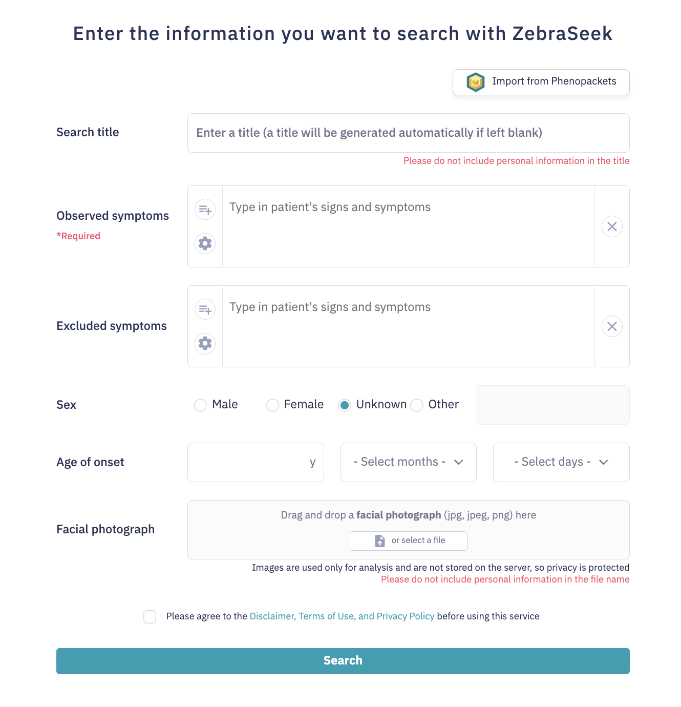

Rare diseases are difficult to diagnose not only because each condition is uncommon, but also because patients can present with incomplete, age-dependent or atypical combinations of findings. Clinicians may therefore have limited prior experience with the eventual diagnosis, and patients can undergo repeated specialist consultations, testing and misdiagnosis before a diagnosis is reached. This prolonged diagnostic odyssey motivates computational approaches that can connect a patient's presentation with rare diseases that may otherwise be difficult to recognize [@DeepRare2026].

The relevant evidence is also distributed across different forms of patient information and biomedical knowledge. The Human Phenotype Ontology (HPO) provides a structured vocabulary for clinical abnormalities [@HPO2024]. PubCaseFinder uses HPO terms to retrieve phenotype-similar case reports and prioritize diseases [@PubCaseFinder2018], whereas GestaltMatcher searches for similar facial phenotypes [@GestaltMatcher2022]. These tools are useful precisely because they view the patient from different perspectives: a disease weakly ranked by one modality may be strongly suggested by another.

Previous multimodal studies have already demonstrated the value of combining such information. PhenoScore combines facial analysis with HPO-based phenotypic similarity [@PhenoScore2023]. GestaltMML integrates facial images with demographic and clinical information [@GestaltMML2026]. PEDIA combines facial and clinical information with exome-based prioritization [@PEDIA2019]. SHEPHERD uses phenotype-aware knowledge-graph representations for several rare-disease diagnostic tasks [@SHEPHERD2025]. These studies establish that multimodal information can improve rare-disease analysis. They also motivate a complementary systems question: how should outputs from independently developed specialist tools be selected, combined and preserved when they do not share the same representation or score scale?

Large language models (LLMs) provide a flexible integration layer for this problem. Recent systems using LLM-based diagnostic workflows include DeepRare [@DeepRare2026], RareAgents [@RareAgents2026] and MEDDxAgent [@MEDDxAgent2025]. DeepRare is particularly relevant because it combines a broad set of specialist tools and medical knowledge sources and returns evidence-linked, traceable reasoning [@DeepRare2026]. Together, these studies show that broad tool orchestration and source-linked explanations are feasible, while leaving a practical design question for systems built from ranked specialist outputs: which candidates should be carried forward for detailed checking, and how should their identity and source remain attached through LLM-mediated integration?

ZebraSeek focuses on this candidate-level problem. Clinical phenotypes, facial images and related information are first processed by specialist components that return ranked disease candidates. These candidate records are then integrated by an LLM, checked against external medical information and reduced to a final ranked differential. Facial evidence is introduced through GestaltMatcher rather than by asking the LLM to interpret a patient photograph directly. Candidate-level integration also makes it possible to retain which tool proposed a disease and, with the strengthened structured outputs introduced during the hackathon, to preserve candidate identifiers and source URLs through later stages. We therefore view ZebraSeek's intended value along three linked axes: effective use of complementary specialist candidates, traceability of where those candidates and supporting evidence came from, and efficient selection of what should be examined in depth.

The current implementation also exposes clear limitations. Each component contributes its top five candidates using a fixed heuristic. A disease ranked below five is invisible to all later LLM reasoning and verification, even if the downstream reasoning is strong. Conversely, simply increasing every list to dozens of candidates increases the number of diseases that must be normalized, searched, compared and verified by the LLM. The specialist scores are also not directly interchangeable: PubCaseFinder ranks diseases from HPO information, whereas GestaltMatcher ranks them from facial images. The present system therefore depends on LLM reasoning to integrate tool-specific candidate lists while operating under a manually chosen candidate budget.

During DBCLS BioHackathon 2026, we investigated this candidate-selection problem rather than treating the fixed top-five setting as immutable. We expanded the analysis to Phenopacket Store v0.1.27 linked with facial images, covering 368 patients, 462 images and 54 disorders, and asked how much diagnostic coverage is hidden below the top five, how quickly the candidate set grows when deeper ranks are included, and whether selecting the number of candidates on a case-by-case basis could offer a more practical balance. Fixed-depth conditions, two zero-shot LLM conditions and a best-case retrospective reference were used as initial baselines for this question rather than as the final method. In parallel, structured outputs were strengthened to keep candidate identity, source tools and URLs explicit through ranking and verification.

# Results

## Complementary evidence creates both opportunities and a selection problem

The organizing principle of ZebraSeek is that a useful disease hypothesis need not be supported by every component (Fig. 1). Phenotype matching, facial similarity, semantic retrieval and direct LLM prediction provide different routes to the same disease vocabulary. Their outputs are candidate proposals, not independent measurements of diagnostic probability: tools can share phenotype annotations, literature and underlying knowledge. Agreement can support review, but the number of agreeing tools is not a calibrated measure of certainty.

Integration must address two questions in sequence. First, is the recorded diagnosis available in any component's candidate list? Second, if available, does it remain in the final differential? A correct candidate absent from one tool can expand that tool's coverage, whereas discarding a candidate supplied by another can offset this benefit. Figure 1 presents this conceptual distinction; the following analyses examine it using the existing component and final-output summaries.

![**From complementary evidence to a reviewable differential.** Different representations can retrieve shared or source-specific disease hypotheses. The conceptual distinction is between candidate availability and retention during shortlist formation. A source-specific candidate may be useful even without cross-tool agreement. Candidate-level integration connects specialist retrieval with LLM ranking and external-information checks; correctness and the value of each stage require separate evaluation.](figures/concept_candidate_retention.png){width=100%}

## ZebraSeek integrates candidate proposals from facial and clinical evidence

In the evaluated workflow, ZebraSeek uses a facial image, HPO-encoded clinical findings and recorded sex (Fig. 2). The facial image is processed by GestaltMatcher, while HPO information is supplied to PubCaseFinder and SemanticSearch. The latter retrieves disease candidates by embedding-based similarity to disease descriptions derived from Mondo. A direct LLM component receives HPO information and sex and separately proposes a differential diagnosis. The evaluated implementation used GPT-5.2 for direct predictions and subsequent integration stages.

Each component returns up to five candidate diseases, yielding at most 20 candidate entries before accounting for overlap. The integration stage compares candidates while retaining information about their source ranks and scores. A verification stage consults external information, including PubMed, and relates candidate diseases to the patient's findings. Explicitly recorded negative findings can be considered during this step. ZebraSeek then returns five ranked candidates with explanatory text. This staged design separates specialist candidate generation from LLM-based integration and external-information checking, while retaining the origin of each candidate for review.

{width=100%}

## A web interface connects clinical input to staged candidate review

The ZebraSeek input interface supports observed and excluded findings, recorded sex, age of onset, facial-image upload and import from Phenopackets (Fig. 3). It brings structured clinical descriptions and facial evidence into one query workflow.

The results view separates tool output, tentative candidates, a stage labelled validation, and final disease candidates. Component tables display disease identifiers, ranks and similarity scores alongside the final differential. This organization allows users to inspect component proposals as well as the integrated result. The validation label denotes the system's external-information checking stage, not independent clinical validation.

{width=90%}

## Higher observed recall in a benchmark of 74 cases

The evaluation set comprised 74 cases spanning 19 diseases, obtained by matching Phenopacket Store v0.1.25 records to facial images in GestaltMatcher Database. The recorded diagnosis served as the reference label; the stated system inputs were facial images, HPO findings and sex. Top-k recall indicates whether the recorded diagnosis appeared among the first k predictions from each method.

ZebraSeek had the highest observed recall at every reported cutoff (Fig. 4). Recall\@1 was 67.6% (50/74), compared with 63.5% (47/74) for PubCaseFinder, 31.1% (23/74) for GestaltMatcher and 18.9% (14/74) for both SemanticSearch and the direct LLM. At rank five, ZebraSeek reached 79.7% (59/74), compared with 71.6% (53/74), 50.0% (37/74), 35.1% (26/74) and 33.8% (25/74) for PubCaseFinder, GestaltMatcher, the direct LLM and SemanticSearch, respectively. Relative to PubCaseFinder, the observed differences were 4.1 percentage points at rank one and 8.1 percentage points at rank five, corresponding to net increases of three and six correctly prioritized cases.

These are descriptive comparisons within the reported benchmark. No confidence intervals, repeated-run variability or significance claims are included in this analysis. The comparison also reflects different input modalities across methods and is not a controlled estimate of the effect of LLM integration alone.

{width=100%}

## Component tools retrieve complementary correct candidates

Among the 59 cases correctly prioritized by ZebraSeek at rank five, the recorded diagnosis was also present in PubCaseFinder's top five for 48 cases, in SemanticSearch's for 25, in the direct LLM's for 26 and in GestaltMatcher's for 35 (Fig. 5). Only 13 of these cases were recovered by all four component tools. The largest exclusive patterns after this four-tool overlap were PubCaseFinder alone (10 cases) and GestaltMatcher alone (seven cases). A further three cases had the recorded diagnosis only in the SemanticSearch candidate list.

ZebraSeek therefore recovered 11 cases in which PubCaseFinder did not retrieve the diagnosis within its top five. Conversely, five cases recovered by PubCaseFinder were missed by ZebraSeek. The difference between these two discordant groups accounts for the net gain of six cases over PubCaseFinder at rank five. This distinction matters: the final list extended coverage beyond the strongest individual component while also losing some of that component's correct candidates.

The observed overlaps support complementary candidate availability, but do not identify the causal contribution of any individual modality. For example, the seven successful cases with GestaltMatcher-only correct candidates motivate a controlled comparison without facial analysis; they do not substitute for that comparison. The integration process may also change its ranking when any component is removed.

{width=100%}

## Candidate coverage and retention account for different failures

ZebraSeek did not include the recorded diagnosis in its top five for 15 cases (Fig. 6). In eight, none of the four component top-five lists contained the diagnosis. These cases expose a coverage limitation in the candidate lists supplied to integration. In the remaining seven, the diagnosis was available from a component but absent from the final list: five had a correct PubCaseFinder-only candidate and two had a correct GestaltMatcher-only candidate. All seven losses therefore involved a diagnosis retrieved by only one component. The aggregate results do not locate the loss within normalization, initial ranking, verification or final selection.

Across the reported overlap patterns, at least one component contained the correct diagnosis in 66 of 74 cases (89.2%). This union is a descriptive measure of candidate coverage with up to 20 entries per case, not a top-five method or a validated performance target. Its difference from ZebraSeek's 59 successful cases identifies seven potentially recoverable diagnoses already present in the inputs.

The 15 failures were concentrated in two of the 19 disease labels: cardiac, facial, and digital anomalies (OMIM:618164; 10 cases) and a label abbreviated as neurodevelopmental disorder with coarse facies (OMIM:618505; five cases). This concentration motivates disease-stratified evaluation in addition to case-level averages.

{width=85%}

## Fixed top-five component inputs create a coverage ceiling

The current ZebraSeek workflow receives only the first five candidates from each component. Because later ranking and verification cannot reconsider a disease that was never passed downstream, the fixed input depth creates a limitation distinct from the retention failures described above. To measure how much potentially useful information lies below this cutoff, we performed a hackathon analysis using Phenopacket Store v0.1.27 linked to facial images, comprising 368 patients, 462 images and 54 recorded disorders. This analysis measures candidate coverage at the image level rather than end-to-end ZebraSeek performance; some patients contribute multiple facial images acquired at different ages or time points while sharing the same patient-level phenotype annotations.

PubCaseFinder covered 73.4% of the 462 image-level instances at rank five, 78.1% at rank ten and 83.5% at rank 30. GestaltMatcher covered 30.3%, 34.6% and 45.0%, respectively. After duplicate diseases were removed, the combined PubCaseFinder and GestaltMatcher lists increased from 77.5% coverage at rank five to 82.7% at rank ten and 89.0% at rank 30 (Fig. 7). The important result is not the top-30 number alone, but the gap between shallow and deeper candidate lists: a fixed top-five input prevents later ZebraSeek stages from seeing diagnoses that the specialist tools can retrieve at lower ranks.

![**Deeper specialist rankings expose candidates hidden by a fixed top-five input limit.** Exact-OMIM inclusion was evaluated for 462 facial-image instances linked to 368 patients across 54 disorders. Bars show candidate coverage for PubCaseFinder (PCF), GestaltMatcher (GM) and their combined lists after duplicate diseases were removed at increasing retrieval depths. Coverage increased from 77.5% at top five to 89.0% at top 30. This figure characterizes the candidate set available before ZebraSeek integration; it is not an end-to-end diagnostic-performance comparison.](figures/expanded_candidate_depth_recall.svg){width=100%}

## Baseline analyses show room for more selective candidate exploration

The increased coverage from deeper rankings creates a second problem. At rank 30, PubCaseFinder and GestaltMatcher together can contribute almost 60 unique diseases per image-level instance. Passing every one of these diseases into external search, normalization, LLM comparison and verification would enlarge the downstream workload. The practical objective is therefore not simply to retrieve as deeply as possible, but to identify enough candidates for each case while avoiding unnecessary downstream processing.

This selection cannot be reduced to one shared numeric threshold because the component tools operate on different modalities and their scores have different meanings and scales. PubCaseFinder uses HPO information, whereas GestaltMatcher uses facial images. We therefore used simple reference conditions to test whether candidate coverage and candidate count are meaningfully affected by how many candidates are taken from each tool.

Fixed candidate depths provide baseline reference points (Table 1). PCF@30 reached 83.55% coverage with 30 candidates on average. The combined PCF@30 and GM@30 lists reached 88.96% coverage but produced 57.57 unique candidates on average after duplicate diseases were removed. Two preliminary zero-shot LLM strategies, using no task-specific training examples, selected how many candidates to take from each tool for each input. The input-only strategy achieved 84.38% coverage with 19.28 candidates on average, whereas the strategy that also received tool results achieved 84.60% with 18.18 candidates on average. One image-level instance could not be evaluated because its image was rejected under the API content-safety policy, so these LLM-based conditions include 461 instances. They are treated as feasibility baselines rather than evidence that LLM-based selection is optimal.

As a best-case retrospective reference, we used the known diagnosis to identify the smallest number of candidates that would still include the correct diagnosis whenever it was available within the evaluated rankings. This reference reaches the same 88.96% coverage as taking the top 30 candidates from both PCF and GM while retaining 2.66 candidates on average. Because it uses the known diagnosis, it is not an executable diagnostic method or a performance target. It indicates that the large candidate set produced by exhaustive deep retrieval contains substantial redundancy from the perspective of including the correct diagnosis, motivating development of practical case-specific selection methods.

**Table 1 | Candidate coverage and average candidate count in the expanded analysis.** The `+` sign denotes the combined candidate lists after duplicate diseases were removed, not arithmetic addition.

| Selection condition | Correct-diagnosis coverage | Mean unique candidates | n |
| --- | ---: | ---: | ---: |
| PCF@5 | 0.7338 | 5.00 | 462 |
| PCF@10 | 0.7814 | 10.00 | 462 |
| PCF@30 | 0.8355 | 30.00 | 462 |
| PCF@5 + GM@5 | 0.7749 | 9.66 | 462 |
| PCF@10 + GM@5 | 0.8160 | 14.58 | 462 |
| PCF@30 + GM@30 | 0.8896 | 57.57 | 462 |
| LLM-selected depth, input only | 0.8438 | 19.28 | 461 |
| LLM-selected depth, input + tool results | 0.8460 | 18.18 | 461 |
| Minimum-depth reference using known diagnosis | 0.8896 | 2.66 | 462 |

The candidate count in Table 1 is a rough measure of how many diseases later stages would need to process, not a direct measurement of computational cost. If PubCaseFinder or GestaltMatcher returns its top 30 in a single request, accepting a shallower depth does not make that upstream tool execution cheaper. The intended saving is in the number of diseases passed to external search, LLM verification and final ranking. Actual token use, latency, API calls and monetary cost remain separate end-to-end evaluation measures.

## Hackathon implementation strengthened traceable candidate handling

The hackathon implementation also strengthened the structured-output contract used between candidate generation, ranking and verification. Candidate decisions are tied to stable candidate identifiers rather than unconstrained disease-name generation, and source-information fields are carried with the candidate record. The revised schema additionally requires source references, including URLs where available, so that evidence used during verification can remain attached to its retrieval source.

This change supports ZebraSeek's original goal of a reviewable differential, but it is distinct from candidate-selection performance. A URL field does not by itself establish that a retrieved source exists, supports the associated claim or was interpreted correctly. Citation fidelity and expert review remain separate evaluation targets. The immediate implementation goal is to make candidate identity and source information explicit and less likely to be lost during LLM-mediated transformations.

# Discussion

ZebraSeek was designed around a practical problem in rare-disease diagnosis: useful evidence is distributed across modalities and specialized resources, yet the final differential must remain compact enough to review. Its intended value is therefore broader than simply using multiple inputs. The system uses specialist tools to generate disease candidates, integrates those candidates at a common disease level, checks them against external information and preserves where the candidates and supporting sources came from. We view these properties as three connected design goals: effective integration of complementary evidence, traceability of candidate and evidence sources, and efficiency in deciding what should receive downstream verification.

The original 74-case benchmark primarily supports the first of these goals. ZebraSeek achieved higher observed top-k recall than each individual component within that evaluation setting. More importantly, the case-level pattern explains how that gain arose: 11 diagnoses were recovered beyond PubCaseFinder's top-five coverage, whereas five diagnoses retrieved by PubCaseFinder were lost during integration. This shows both the value and the risk of candidate-level integration. Expanding the candidate pool can recover diagnoses missed by an individual tool, but the downstream ranking process can still discard useful source-specific candidates.

Previous multimodal and agentic systems provide important foundations for this design. PhenoScore demonstrates integration of facial analysis with HPO-based phenotypic similarity [@PhenoScore2023]. GestaltMML integrates facial images with demographic and clinical information [@GestaltMML2026]. PEDIA combines facial and clinical information with exome-based prioritization [@PEDIA2019]. SHEPHERD uses a knowledge graph to support phenotype-driven diagnostic tasks [@SHEPHERD2025]. DeepRare goes further by orchestrating multiple tools and heterogeneous medical knowledge sources and by returning reasoning linked to verifiable references [@DeepRare2026]. Against this background, ZebraSeek contributes a modular candidate-level workflow in which independently developed specialist tools remain identifiable through integration, and in which the size of the downstream candidate set can itself be treated as a design variable.

That design variable matters because the current ZebraSeek implementation uses a heuristic top-five cutoff for every component. This choice keeps the integration input small, but it creates an upper limit on what later reasoning can recover. A stronger LLM cannot select a disease that was never passed to it. At the opposite extreme, forwarding dozens of candidates from every tool increases the amount of evidence retrieval, comparison and LLM-based verification. The system is therefore affected both by the quality of LLM reasoning and by the upstream decision about which candidate diseases the LLM is allowed to consider.

The expanded BioHackathon analysis makes this trade-off measurable. Deeper PCF and GM rankings contain correct diagnoses that are not present in their top-five lists, but exhaustive PCF@30 plus GM@30 produces 57.57 unique candidates on average. The fixed-depth and zero-shot comparisons were not intended to identify a winning method; they were first checks of whether case-specific candidate selection is a worthwhile direction. The best-case retrospective reference further shows that, in principle, far fewer candidates would have been sufficient when the correct depth is known in hindsight. The next research step is therefore to develop practical selection rules that approach broad coverage without passing the full deep ranking to later stages.

This question is also consistent with limitations identified in broader agentic approaches. DeepRare demonstrates the value of broad evidence-grounded orchestration, while also identifying more refined and adaptive retrieval as a future direction [@DeepRare2026]. ZebraSeek examines one concrete version of that problem: how far to explore ranked outputs from modality-specific specialist tools before LLM-based integration and verification. Because PCF and GM scores are not directly comparable and arise from different input types, the selection strategy must operate across heterogeneous candidate lists rather than assuming a shared calibrated score.

The structured-output revision addresses a separate but complementary weakness of LLM-mediated pipelines. Free-form transformations can change disease names, lose identifiers or detach evidence from the candidate it was meant to support. ZebraSeek therefore uses stable candidate identifiers and carries source fields, including URLs where available, through later stages. This improves source traceability, but it should not be confused with proof of evidence quality. Whether a URL exists, whether the source actually supports the generated statement and whether the medical interpretation is correct require separate validation.

Several limitations constrain the present interpretation. The original benchmark is retrospective, small and selected for availability of both phenopackets and facial images. The expanded analysis contains 462 images from 368 patients; some patients therefore contribute multiple image-level observations from different ages or time points while sharing the same phenotype annotations, so these observations are not independent patient-level tests. The reported 54 disorders remain unevenly represented. In the zero-shot LLM analysis, one image was rejected by the API content-safety policy, reducing the denominator from 462 to 461. No controlled end-to-end comparison has yet shown that case-specific candidate selection improves final ZebraSeek Recall@5, latency, token use or monetary cost. Repeated-run variability, disease-stratified performance and patient-wise held-out evaluation are also required.

Literature-derived cases additionally require careful consideration of information overlap. Source publications, related patients or query images may be represented in phenotype resources, facial reference galleries, model training corpora or verification-time retrieval. Removing explicit diagnoses from the query is necessary but insufficient to rule out these routes. Independent cases and transparent source information are needed to test generalization; expert evaluation is additionally required to assess explanations and any effect on diagnostic decisions. The present findings do not establish molecular diagnostic yield, clinical benefit or equitable performance.

The resulting research question is therefore not simply whether more modalities or a stronger LLM improve accuracy. It is how to acquire complementary specialist candidates deeply enough to avoid preventable candidate loss, select them narrowly enough to keep downstream reasoning practical, and preserve enough source information for the final differential to be independently reviewed. The current ZebraSeek implementation, original 74-case benchmark and BioHackathon candidate-depth analysis provide an initial framework for answering that question rather than a completed clinical validation.

# Methods

## Study design and original case selection

The original study retrospectively evaluated 74 literature-derived cases covering 19 diseases. Phenotypic descriptions, sex and recorded diagnoses were obtained from Phenopacket Store v0.1.25, a corpus built using the GA4GH Phenopacket representation [@PhenopacketStore2025]. Cases were linked to facial images in GestaltMatcher Database, a resource for facial phenotyping [@GMDB2024], by matching records corresponding to the same individual across the two resources.

## Expanded analysis of candidate-list depth

The hackathon analysis used Phenopacket Store v0.1.27 and matched facial-image data, yielding 368 patients, 462 facial-image instances and 54 recorded disorders. Some patients contributed multiple facial images acquired at different ages or time points. These image-level instances shared the same patient-level phenotype annotations, while the facial image and the age corresponding to that image could differ. Candidate coverage was therefore evaluated at the image-instance level. PubCaseFinder and GestaltMatcher rankings were examined to a maximum depth of 30. Exact-OMIM coverage was defined as the fraction of evaluated instances for which the recorded OMIM diagnosis was present in the accepted candidate set after duplicate diseases were removed.

PubCaseFinder uses HPO information, whereas GestaltMatcher uses facial images. Their internal scores may have different meanings and scales and are not assumed to be directly comparable. The common information available to downstream ZebraSeek integration is therefore the ranked disease candidate, together with tool-specific rank, score and source metadata.

For an instance $x_i$, let $R_j(x_i)=(c_{ij1},\ldots,c_{ijK_j})$ be the ranking returned by candidate generator $T_j$. A selection strategy chooses an accepted depth $k_{ij}$ for each generator. The downstream candidate set is

$$
C_{\pi}(x_i)=\bigcup_j\{c_{ij1},\ldots,c_{ij k_{ij}}\},
$$

with duplicate diseases removed. Coverage is

$$
\mathrm{Coverage}(\pi)=\frac{1}{N}\sum_i \mathbf{1}[y_i\in C_{\pi}(x_i)].
$$

The practical objective is to retain high candidate coverage while reducing the mean number of unique diseases passed to later stages, or ultimately the measured downstream computational cost. Candidate count and actual compute cost are reported separately because the two are not equivalent. In the present implementation PubCaseFinder and GestaltMatcher can return deep rankings in a single execution, so the accepted depth primarily changes the number of candidates entering later search, LLM verification and ranking stages rather than the cost of the upstream tools themselves.

## Candidate-selection comparison conditions

Fixed-depth baselines applied the same accepted depth to all instances. The reported conditions include PCF@5, PCF@10, PCF@30, and selected PCF--GM combinations with duplicate diseases removed. Mean candidate count was calculated after deduplication across the two component rankings.

The zero-shot LLM conditions used GPT-5.2 through the API with reasoning effort set to medium and no task-specific training examples. The LLM was asked to choose candidate depths per input; one condition used input information only, and a second also received component-tool results. One image-level instance could not be evaluated because the image was rejected under the API content-safety policy. Aggregate coverage and mean candidate counts are therefore reported for 461 image-level instances in these conditions.

For a best-case retrospective reference, the known diagnosis and its position in each ranking were used to choose the smallest accepted candidate set that still contained the correct diagnosis whenever it was available within the maximum evaluated depths. This reference is used only to estimate how much the number of downstream candidates could theoretically be reduced if the appropriate depth were known in advance; it is not an executable diagnostic method.

## Input preparation and reference diagnoses

ZebraSeek used facial images, HPO findings and recorded sex. The reference diagnosis was used for evaluation rather than intentionally supplied as a model input. HPO provides standardized identifiers for phenotypic abnormalities [@HPO2024]. The workflow can also consider explicitly recorded negative findings.

## Interface documentation

The application interface supports Phenopacket import, observed and excluded findings, recorded sex, age of onset and facial-image upload. The results interface exposes component outputs, tentative candidates, external-information checking and final disease candidates.

## Candidate generation

PubCaseFinder generated candidates from HPO findings using phenotype-based disease matching [@PubCaseFinder2018]. GestaltMatcher generated candidates from facial images [@GestaltMatcher2022]. SemanticSearch compared phenotype information with embeddings of disease descriptions obtained from Mondo, which integrates disease terminology across resources [@Mondo2026]. The direct LLM component used HPO findings and sex in a zero-shot setting. Each component supplied up to five candidates in the original ZebraSeek benchmark. The expanded analysis separately examined PubCaseFinder and GestaltMatcher to rank 30.

## Candidate integration, verification and source tracking

The original integration stage received up to 20 candidate entries with source ranks and scores and used an LLM to rank candidate diseases. A verification stage related candidates to the available phenotype information and consulted external medical information, including PubMed. The workflow then generated a final top-five ranking and explanatory text.

During the hackathon the structured-output contract was strengthened to preserve candidate identity and source information through these stages. Candidate decisions are represented with candidate identifiers rather than relying only on unconstrained disease-name text, and source-reference fields include URLs where available. This structure is intended to make the origin of evidence and candidate transformations easier to audit; factual correctness and citation fidelity remain separate evaluation targets.

## Evaluation metrics and descriptive analysis

For the original benchmark, top-k recall was the fraction of 74 cases for which the recorded diagnosis occurred among the first k predictions, with k ranging from one to five. The expanded depth-selection analysis instead uses candidate coverage: whether the exact reference OMIM diagnosis appears anywhere in the accepted candidate set after duplicate diseases are removed. These quantities answer different questions and are not directly interchangeable.

The overlap summaries distinguish successful ZebraSeek cases from its failures and use the component top-five lists. Candidate availability denotes presence of the recorded diagnosis in at least one component top-five list; retention denotes its continued presence in the final top-five list when initially available.

The expanded analysis reports candidate coverage and mean unique downstream candidate count as separate axes. Candidate count is treated as a rough indicator of how many diseases later stages must process rather than as a direct measurement of API calls, token use, wall-clock time or monetary cost.

## Ethics and data governance

The benchmarks are secondary analyses of literature-derived cases and associated facial images. This manuscript reports aggregate figures, schematics and an unpopulated interface screenshot and does not redistribute patient photographs or populated patient records.

# Data availability

The aggregate values used for the original figures are provided in `paper/data/aggregate_results.json`. The hackathon candidate-depth summary is provided in `paper/data/adaptive_candidate_depth_summary.csv`. These files contain aggregate evaluation values rather than patient-level source data. Phenopacket Store is described in the cited resource paper [@PhenopacketStore2025]. Facial-image access is governed by GestaltMatcher Database. The manuscript repository does not redistribute the underlying patient images.

# Code availability

The manuscript source and scripts used to reproduce its aggregate figures are available at [the manuscript repository](https://github.com/PubCaseFinder/biohackathon-2026-zebraseek-paper). The ZebraSeek implementation is developed at [708san/AI_AgentWithLangGraph](https://github.com/708san/AI_AgentWithLangGraph), whose public README describes the rare-disease diagnosis pipeline, Phenopacket runner and optional prompt/node logging. The manuscript figure-generation scripts reproduce aggregate study summaries; they are not the diagnostic implementation.

# Acknowledgements

# Author contributions

# Competing interests

# Additional information

# References